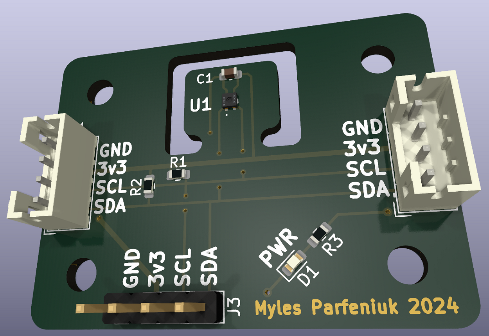

Table of Contents

<ol>
<li><a href="#about">About</a></li>
<li><a href="#operating-voltages">Operating Voltages</a></li>
<li><a href="#pcb-renders">PCB Renders</a></li>
<li><a href="#schematic">Schematic</a></li>
<li><a href="#contact">Contact</a></li>
</ol>

# About
Breakout board for Würth Elektronik 2525020210002 humidity w/ integrated temperature sensor IC.   
This repo contains all the schematic and layout files in the form of a KiCad project, they can be found within the `kicad` directory.

(<a href="#readme-top">back to top</a>)

# Operating Voltages
| Pin | Min.| Max. |
|----------|----------|----------|
| Vdd    | 1.08  | 3.6   |
| SCL/SDA    | -0.3  | 3.9  |

(<a href="#readme-top">back to top</a>)

# PCB Renders
  

  

(<a href="#readme-top">back to top</a>)

# Schematic
  

(<a href="#readme-top">back to top</a>)

# Contact
Myles Parfeniuk - myles.parfenyuk@gmail.com  

Project Link: [myles-parfeniuk/wsen_hids_breakout](myles-parfeniuk/wsen_hids_breakout)

(<a href="#readme-top">back to top</a>)
