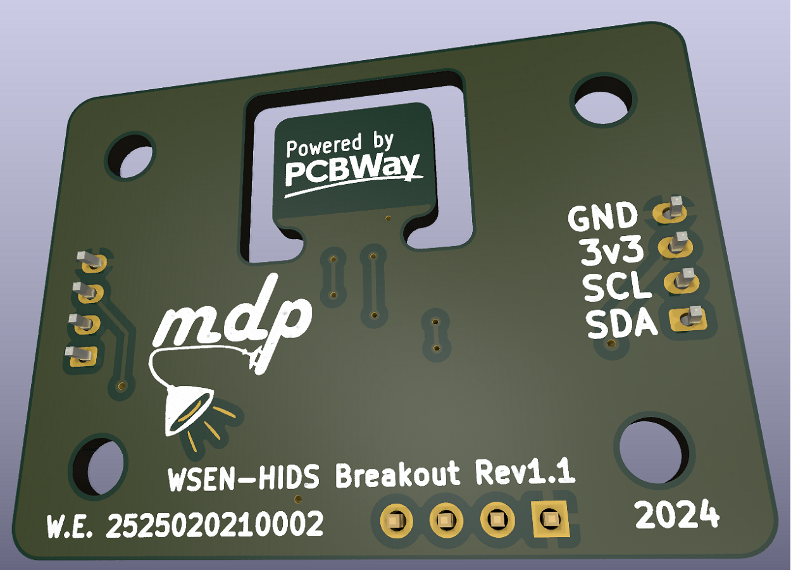

Table of Contents

<ol>
<li><a href="#about">About</a></li>
<li><a href="#pcbway-sponsorship">PCBWay Sponsorship</a></li>
<li><a href="#pcb-renders">PCB Renders</a></li>
<li><a href="#schematic">Schematic</a></li>
<li><a href="#operating-voltages">Operating Voltages</a></li>
<li><a href="#contact">Contact</a></li>
</ol>

# About
Breakout board for [Würth Elektronik 2525020210002](https://www.we-online.com/en/components/products/WSEN-HIDS) humidity w/ integrated temperature sensor IC.   
This repo contains all the schematic and layout files in the form of a KiCad project, they can be found within the `kicad` directory.

(<a href="#readme-top">back to top</a>)

# PCBWay Sponsorship
Special thanks to PCBWay for sponsoring this project and providing access to their excellent service.  
PCBWay supports the DIY and open source community as well as students with sponsorships and contests frequently.   
Show them some love and consider having your next project fabricated by them: 

 

[https://www.pcbway.com/](https://www.pcbway.com/)

(<a href="#readme-top">back to top</a>)

# PCB Renders
  

  

(<a href="#readme-top">back to top</a>)

# Schematic
  

(<a href="#readme-top">back to top</a>)

# Operating Voltages
| Pin | Min.| Max. |
|----------|----------|----------|
| 3v3    | 1.08  | 3.6   |
| SCL/SDA    | -0.3  | 3.9  |

(<a href="#readme-top">back to top</a>)

# Contact
Myles Parfeniuk — myles.parfenyuk@gmail.com  

Project Link — [myles-parfeniuk/wsen_hids_breakout](myles-parfeniuk/wsen_hids_breakout)

(<a href="#readme-top">back to top</a>)
