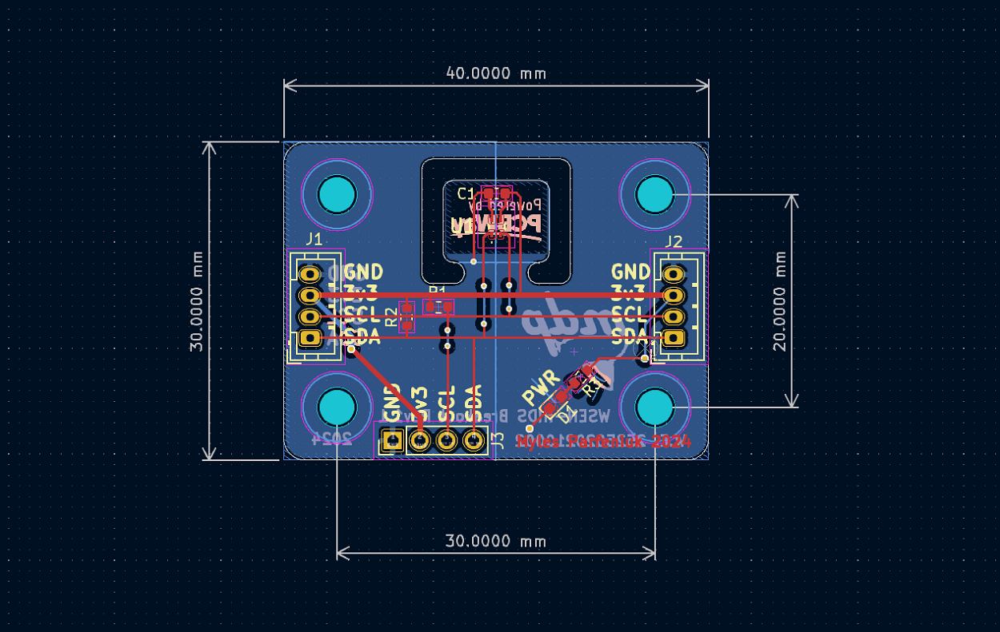

Table of Contents

<ol>
<li><a href="#about">About</a></li>
<li><a href="#pcbway-sponsorship">PCBWay Sponsorship</a></li>
<li><a href="#gerber-files">Gerber Files</a></li>
<li><a href="#pcb-renders">PCB Renders</a></li>
<li><a href="#schematic-and-layout">Schematic and Layout</a></li>
<li><a href="#operating-voltages">Operating Voltages</a></li>
<li><a href="#contact">Contact</a></li>
</ol>

# About
Breakout board for [Würth Elektronik 2525020210002](https://www.we-online.com/en/components/products/WSEN-HIDS) I2C humidity w/ integrated temperature sensor IC.   
This repo contains all the schematic and layout files in the form of a KiCad project, they can be found within the `kicad` directory.

(<a href="#readme-top">back to top</a>)

# PCBWay Sponsorship
Special thanks to PCBWay for reaching out to sponsor this project and provide access to their excellent service.  
PCBWay supports the DIY and open source community as well as students with sponsorships and contests frequently.   
Show them some love and consider having your next project fabricated by them: 

 

Order [here](https://www.pcbway.com/) today.

The boards manufactured by PCBWay had quality that exceeded my expectations.  
The silk screen was less smudged and noticeably more detailed than other fab houses I've used before. All 5 of the boards in my order had no defects, both cosmetic, and functionally.   

The shipping was also insanely quick; I live overseas from China, despite that, with standard shipping the boards were at my place within 2 weeks of uploading the gerbers.    
Their website also had an easy to follow [guide](https://www.pcbway.com/blog/help_center/Generate_Gerber_file_from_Kicad.html) on the settings they require for generated gerbers, this made ordering a breeze. Their [capabilities page](https://www.pcbway.com/capabilities.html) was also easy to follow for setting the constraints within KiCad.  

Overall, I was very satisfied with the result, I'll definitely be using them for any future projects. 

  

(<a href="#readme-top">back to top</a>)

# Gerber Files
Generated gerber and drill files can be found within the gerbers.7z archive.   
These files were generated according to PCBWay's desired settings, thus, they can be used to order the boards from them without re-plotting.

(<a href="#readme-top">back to top</a>)

# PCB Renders
  

  

(<a href="#readme-top">back to top</a>)

# Schematic and Layout
  
 

(<a href="#readme-top">back to top</a>)

# Operating Voltages
| Pin | Min.| Max. |
|----------|----------|----------|
| 3v3    | 1.08  | 3.6   |
| SCL/SDA    | -0.3  | 3.9  |

(<a href="#readme-top">back to top</a>)

# Contact
Myles Parfeniuk — myles.parfenyuk@gmail.com  

Project Link — [myles-parfeniuk/wsen_hids_breakout](myles-parfeniuk/wsen_hids_breakout)

(<a href="#readme-top">back to top</a>)
